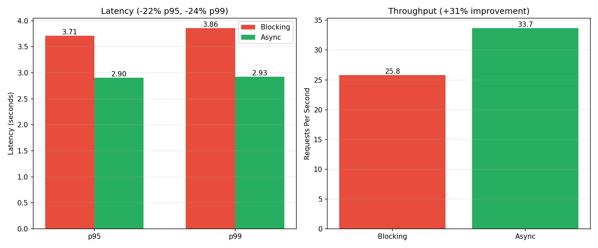

# Detecting Event Loop Blocking with pyleak

A demo showing how synchronous code silently blocks the asyncio event loop in FastAPI, and how [pyleak](https://github.com/coderustic/pyleak) detects it.

## The Problem

A PDF ingestion endpoint that looks async but blocks:

```python
@app.post("/ingest/blocking")
async def ingest_blocking(file: UploadFile):
    pdf_bytes = await file.read()

    doc = fitz.open(stream=pdf_bytes, filetype="pdf")  # Blocks
    text = _extract_text(doc)  # Blocks
    extracted = _extract_images(doc)  # Blocks

    for idx, (page_num, img_index, img_bytes, ext) in enumerate(extracted):
        s3_key = f"{document_id}/img_{idx}.{ext}"
        _upload_to_s3(s3_key, img_bytes, f"image/{ext}")  # Blocks

    return IngestResponse(...)
```

Even with `async def`, the synchronous `fitz` (PyMuPDF) and `boto3` calls block the event loop, serializing all concurrent requests.

## Detecting with pyleak

```python
@pytest.mark.asyncio
async def test_blocking_endpoint_detected(sample_pdf: bytes):
    async with AsyncClient(transport=ASGITransport(app=app), base_url="http://test") as client:
        with pytest.raises(EventLoopBlockError):
            async with no_event_loop_blocking(action="raise", threshold=0.01):
                await client.post("/ingest/blocking", files={"file": ("test.pdf", sample_pdf)})
```

pyleak catches the blocking and shows exactly where:

```
Event Loop Block: block-1
  Duration: 0.010s (threshold: 0.010s)
  Blocking Stack:
      ...
      File "src/pdf_ingest/app.py", line 86, in ingest_blocking
          _upload_to_s3(s3_key, img_bytes, f"image/{ext}")  # Blocks
      File "src/pdf_ingest/app.py", line 60, in _upload_to_s3
          s3_client.put_object(
```

## The Fix

Offload blocking work to threads with `asyncio.to_thread()`:

```python
@app.post("/ingest/async")
async def ingest_async(file: UploadFile):
    pdf_bytes = await file.read()

    # Offload CPU-bound PDF processing to thread pool
    text, page_count, extracted = await asyncio.to_thread(_process_pdf_sync, pdf_bytes)

    # Upload images concurrently
    upload_tasks = [
        _upload_image_async(document_id, idx, page_num, img_index, img_bytes, ext)
        for idx, (page_num, img_index, img_bytes, ext) in enumerate(extracted)
    ]
    images = await asyncio.gather(*upload_tasks)

    return IngestResponse(...)
```

## Results

100 concurrent requests:



```
Blocking:
  p50: 2.00s | p95: 3.67s | p99: 3.81s
  Throughput: 26.1 RPS

Async:
  p50: 2.46s | p95: 2.90s | p99: 2.91s
  Throughput: 33.8 RPS

Improvement: +30% throughput, -24% p99 latency
```

## Quick Start

```bash
uv sync
docker-compose up -d   # Start MinIO

# Run tests
uv run pytest tests/ -v -s

# Run load test
uv run uvicorn pdf_ingest:app --reload
uv run python scripts/load_test.py scripts/sample.pdf 100
```
